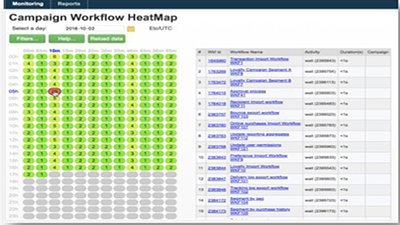
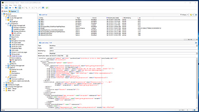
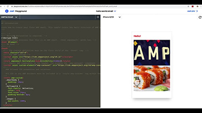

# Adobe Campaign Classic 教學課程 – 概觀

Adobe Campaign 為跨通路客戶體驗的設計提供了平台，並為可視性行銷活動的策劃、即時互動管理和跨通路執行提供了環境。本使用手冊包含了有關 Adobe Campaign Classic 許多功能的影片和教學課程。

## 新增功能

* **[建立跨頻道行銷活動](/help/orchestrating-campaigns/cross-channel-campaigns.md)**

   *瞭解如何建立和執行跨頻道行銷活動。*

* **[使用控制群組](/help/sending-messages/email-channel/use-control-groups.md)**

   *瞭解控制群組的概念，並瞭解如何使用控制群組進行傳遞。*

* **[傳送及驗證證明](/help/sending-messages/email-channel/send-and-validate-proofs.md)**

   *瞭解如何傳送及驗證證明。*

* **[設計電子郵件，以提供傳遞能力](/help/sending-messages/email-channel/design-emails-for-deliverability.md)**

   *瞭解如何套用傳遞能力最佳實務。*

* **[建立和設計電子郵件傳遞](/help/sending-messages/email-channel/create-and-design-email-deliveries.md)**

   *瞭解建立電子郵件傳遞的流程，並瞭解如何設計和個人化電子郵件內容。*

## 員工精選

<table>
<tr>
  <td>
    
    

      <a href="./monitoring-campaign-classic/workflow-heatmap.md">
    <strong>工作流程熱度圖</strong>
    </a>
    

    

    <em>取得並行工作流程數目的概觀。</em>
    

  </td>
   <td>
    
    

      <a href="./monitoring-campaign-classic/audit-trail.md">
    <strong>稽核軌跡</strong>
    </a>
    
 
    

    <em>擷取在 Adobe Campaign 發生的動作和事件的完整清單。</em>
    

  </td>
  <td>
    
    

      <a href="./sending-messages/email-channel/defining-interactive-email-content-with-amp.md">
    <strong>使用 AMP 定義互動式電子郵件內容</strong>
    </a>
    

    

    <em>瞭解如何在 Adobe Campaign Classic 中啟動和使用 AMP </em>
    

  </td>
</tr>
</table>

## 其他資源

* [文件](https://docs.adobe.com/content/help/zh-Hant/campaign-classic/using/getting-started/starting-with-adobe-campaign/about-adobe-campaign-classic.html)
